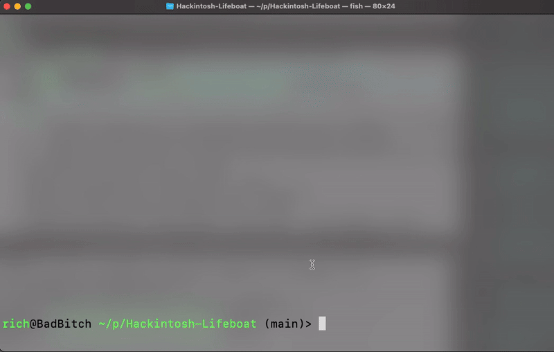

# Hackintosh Lifeboat

**Preserve your Hackintosh bootable USB before it fails.**

Hackintosh bootable USB drives have a limited lifespan. USB flash memory degrades over time, and a single cosmic ray (solar flare, EMP, or just age) can corrupt your carefully crafted OpenCore or Clover bootloader—leaving you unable to boot or reinstall. **Hackintosh Lifeboat** creates bit-perfect, compressed backup images of your bootable USB so you can restore a working drive whenever you need it.



## Why Hackintosh Lifeboat?

USB drives aren't reliable long-term storage. Your Hackintosh bootable USB is irreplaceable—if it fails, you're starting over from scratch. Hackintosh Lifeboat solves this:

- **USB Failure Insurance**: Capture your working bootable USB before it fails
- **Bit-Perfect Recovery**: Saves every byte, including hidden partitions and bootloader data
- **Easy Restore**: Your backup works across Windows (Rufus), Mac, and Linux (balenaEtcher)
- **Fast Backups**: 32GB bootable USBs typically compress to ~15-25GB, backing up in minutes

## When to Use It

- **Right after creating your bootable USB** - Before you use it for installation
- **After successful Hackintosh deployment** - You've got a working system, now protect your installer
- **Periodically** - USB degradation is unpredictable; re-backup every 6-12 months as insurance
- **Before lending your USB to someone** - Restore a fresh copy afterward

## Features

- **Bit-Perfect Backups**: Captures the entire USB, including all partitions and bootloader data
- **Compressed Format**: Saves as `.img.gz` for efficient storage (32GB USB typically compresses to 15-25GB)
- **Universal Compatibility**: Compatible with Rufus (Windows), balenaEtcher (Mac/Linux), and `dd`
- **TUI Interface**: Professional terminal interface with real-time progress tracking
- **Optional Progress Bar**: Install `pv` for a live backup progress indicator

## Requirements

- **macOS** (tested on Big Sur and later)
- **External storage** with at least 32GB free space (recommended for most Hackintosh USBs)
- **Sudo/Admin access** (required to read the raw disk)
- **Your bootable USB drive** plugged in and recognized by macOS

## Installation

**Clone the repo**:

```bash
git clone https://github.com/richknowles/Hackintosh-Lifeboat
cd Hackintosh-Lifeboat
```

**Make it executable**:

```bash
chmod +x Hackintosh-Lifeboat.command
```

**Install Dependencies (Optional but Recommended)**:

```bash
brew install pv
```

This adds a real-time progress bar during backup, so you can see exactly how long your backup will take.

## Usage

**Easy way** - Double-click the script:
- Navigate to the `Hackintosh-Lifeboat` folder in Finder
- Double-click `Hackintosh-Lifeboat.command`
- Follow the prompts

**Terminal way**:

```bash
./Hackintosh-Lifeboat.command
```

The script will:
1. List your available external drives and USB devices
2. Ask you to confirm which USB to backup
3. Display your target backup location and estimated size
4. Unmount the drive safely
5. Create a bit-perfect compressed image
6. Show you where the backup was saved

**Note**: The first run will prompt for your sudo password. This is necessary to read the raw disk data.

## How to Restore

Your backup is saved as `Hackintosh_Backup_YYYY-MM-DD.img.gz`.

### On Windows

1. Download and install **[Rufus](https://rufus.ie/)**
2. Plug in your target USB drive (must be at least 32GB)
3. Open Rufus and select your `.img.gz` backup file
4. Click "Start" and wait for the write to complete
5. Boot from the restored USB

### On Mac or Linux

**Using balenaEtcher** (recommended - graphical):
1. Download **[balenaEtcher](https://www.balena.io/etcher/)**
2. Open balenaEtcher
3. Select your backup file
4. Select your target USB drive
5. Click "Flash"

**Using `dd` (advanced users)**:
```bash
# First, identify your USB drive (e.g., /dev/disk2)
diskutil list

# Unmount it (replace disk2 with your drive)
diskutil unmountDisk /dev/disk2

# Restore from backup (replace disk2 and path to your backup)
gunzip -c ~/path/to/Hackintosh_Backup_2026-03-23.img.gz | sudo dd of=/dev/rdisk2 bs=1m
```

## Troubleshooting

**"Permission denied" error**
- Make sure the script is executable: `chmod +x Hackintosh-Lifeboat.command`
- The script will prompt for your sudo password during backup

**Backup is very slow**
- Install `pv` for a progress indicator: `brew install pv`
- USB backup speed depends on your drive and connection type (USB 2.0 vs USB 3.0)
- Tip: USB 3.0+ is recommended for reasonable backup times

**"Not enough space" error**
- Your external storage doesn't have enough free space for the backup
- Typical 32GB bootable USB will compress to ~15-25GB depending on what's installed

**Script exits unexpectedly**
- Ensure your bootable USB is properly connected and recognized by macOS
- Run `diskutil list external physical` to verify your USB is visible
- Make sure you have write permissions to your backup destination

## Future Roadmap

- **Full Hackintosh system backup** - Back up your entire installed Hackintosh drive for complete system recovery
- **Scheduled backups** - Automated periodic backups
- **Backup verification** - Integrity checking for restored images

## Contributing

Found a bug? Have a feature idea? Contributions are welcome!

This tool was built for the Hackintosh community by the Hackintosh community. Special thanks to:
- The OpenCore project and community
- All the Hackintosh builders who inspired this tool

Built with ❤️ by Rich Knowles

## License

[Add your license here - MIT, GPL, etc.]